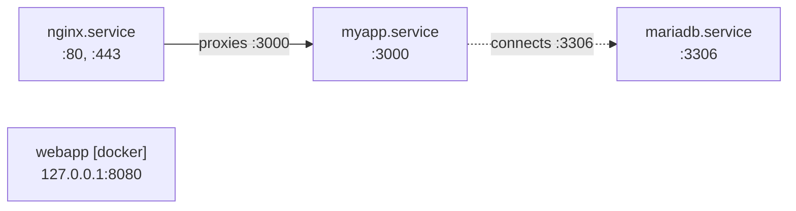

# servicemap

**English** · [한국어](#한국어)

Map running services, listening ports, and their proxy/connection relationships on Linux.

```bash
sudo servicemap
```

Output (tree format, default):

```
mariadb.service
  └─ listens :3306

myapp.service
  └─ listens :3000
  └─ connects to mariadb.service (:3306)

nginx.service
  └─ listens :80
  └─ proxies to myapp.service (:3000)

abcdef123456 [docker]
  └─ listens :8080
```

## Install

### From source

```bash
go install github.com/LeeSeokBln/servicemap/cmd/servicemap@latest
```

### From release tarball

Download the latest release from [GitHub Releases](https://github.com/LeeSeokBln/servicemap/releases), extract, and add to your PATH:

```bash
tar xzf servicemap_*_linux_amd64.tar.gz
sudo mv servicemap /usr/local/bin/
```

## Usage

```
servicemap [flags]

Flags:
  -f, --format FORMAT      output format: tree, mermaid, md, json (default "tree")
  -o, --output PATH        write output to file (infers format from extension)
  --all                    show all nodes (by default, plain processes that
                           neither listen nor are systemd/docker services are hidden)
  --version                print version
  --proc-root PATH         root of /proc for testing (default "/")
```

Exit codes:
- 0: success
- 1: error (bad flags, permission denied, etc.)

## Output formats

### Tree (default)

Tree view of services and their relationships:

```
mariadb.service
  └─ listens :3306

myapp.service
  └─ listens :3000
  └─ connects to mariadb.service (:3306)

nginx.service
  └─ listens :80, :443
  └─ proxies to myapp.service (:3000)

webapp [docker]
  └─ listens 127.0.0.1:8080
```

### Mermaid

Flowchart for visualization in documentation or Slack:



### Markdown

Structured output for reports:

```markdown
# Service Map

| Service | Kind | Listens | Connections |
|---|---|---|---|
| mariadb.service | systemd | :3306 |  |
| myapp.service | systemd | :3000 | connects to mariadb.service (:3306) |
| nginx.service | systemd | :80, :443 | proxies to myapp.service (:3000) |
| webapp | docker | 127.0.0.1:8080 |  |

\`\`\`mermaid
flowchart LR
    n1 -.->|connects :3306| n0
    n2 -->|proxies :3000| n1
\`\`\`
```

### JSON

Complete graph in JSON for programmatic access:

```json
{
  "nodes": [
    {"id": "unit:mariadb.service", "name": "mariadb.service", "kind": "systemd", "listens": [":3306"], "pids": [300]},
    {"id": "unit:myapp.service", "name": "myapp.service", "kind": "systemd", "listens": [":3000"], "pids": [200]},
    {"id": "unit:nginx.service", "name": "nginx.service", "kind": "systemd", "listens": [":80", ":443"], "pids": [100, 101]}
  ],
  "edges": [
    {"from": "unit:myapp.service", "to": "unit:mariadb.service", "kind": "connects", "ports": [3306]},
    {"from": "unit:nginx.service", "to": "unit:myapp.service", "kind": "proxies", "ports": [3000]}
  ]
}
```

## How it works

No daemon, no setup, no external tools — a single pass over `/proc`:

1. **Find sockets** — reads `/proc/net/tcp` and `/proc/net/udp` for listening ports and live TCP connections. Containers with their own network namespace get their `/proc/[pid]/net` tables read as well.
2. **Match sockets to processes** — socket inodes in `/proc/[pid]/fd` tie every socket to the process that owns it.
3. **Identify services** — `/proc/[pid]/cgroup` reveals the systemd unit or docker container ID; container names are resolved through the Docker socket.
4. **Add proxy routes** — parses the nginx config (from the `-c` flag or `/etc/nginx/nginx.conf`), following `include`s and expanding `upstream` blocks, so idle `proxy_pass` routes appear even with no live traffic.
5. **Draw the map** — merges runtime connections and config routes into one graph. Plain processes that neither listen nor belong to a service are hidden by default (`--all` shows them); UDP appears as listens only, without connection edges.

## Permissions

Running without `sudo` can read all listening ports from `/proc/net`, but cannot read other users' `/proc/[pid]/fd` directories — so services owned by other users lose their socket attribution and edges. The tool continues and prints a stderr warning with the count of uninspectable processes. For a complete map with all users' services:

```bash
sudo servicemap
```

## Limitations

- **nginx config parsing only** — other proxies (HAProxy, Envoy, Apache) are not yet parsed; their routes appear as external TCP connects only.
- **UDP connections not tracked** — UDP listening ports are shown, but no edge information about which process sends to which UDP service.
- **Docker published ports via DNAT** — ports exposed through Docker's port publishing (e.g. `-p 80:8080`) may show the `docker-proxy` process's bind instead of the container's internal port.
- **Hostname resolution** — nginx proxy targets given as hostnames that resolve to local IPs are shown as external nodes (not yet resolved to local services).

## License

MIT — see [LICENSE](LICENSE).

---

## 한국어

Linux에서 실행 중인 서비스, 리스닝 포트, 그리고 프록시/연결 관계를 지도화합니다.

```bash
sudo servicemap
```

출력 (기본값: tree 포맷):

```
mariadb.service
  └─ listens :3306

myapp.service
  └─ listens :3000
  └─ connects to mariadb.service (:3306)

nginx.service
  └─ listens :80
  └─ proxies to myapp.service (:3000)

abcdef123456 [docker]
  └─ listens :8080
```

### 설치

#### 소스에서 빌드

```bash
go install github.com/LeeSeokBln/servicemap/cmd/servicemap@latest
```

#### 릴리즈 타르볼

[GitHub Releases](https://github.com/LeeSeokBln/servicemap/releases)에서 최신 버전을 받아서 PATH에 추가합니다:

```bash
tar xzf servicemap_*_linux_amd64.tar.gz
sudo mv servicemap /usr/local/bin/
```

### 사용법

```
servicemap [플래그]

플래그:
  -f, --format FORMAT      출력 포맷: tree, mermaid, md, json (기본값 "tree")
  -o, --output PATH        출력을 파일에 저장 (확장자에서 포맷 자동 감지)
  --all                    모든 노드 표시 (기본값: systemd/docker 서비스를 제외한
                           순수 프로세스 노드는 숨김)
  --version                버전 출력
  --proc-root PATH         테스트용 /proc 루트 (기본값 "/")
```

종료 코드:
- 0: 성공
- 1: 에러 (잘못된 플래그, 권한 거부 등)

### 출력 포맷

#### Tree (기본값)

서비스와 관계를 트리로 표시:

```
mariadb.service
  └─ listens :3306

myapp.service
  └─ listens :3000
  └─ connects to mariadb.service (:3306)

nginx.service
  └─ listens :80, :443
  └─ proxies to myapp.service (:3000)

webapp [docker]
  └─ listens 127.0.0.1:8080
```

#### Mermaid

문서나 Slack에서 시각화할 수 있는 플로우차트:


#### Markdown

리포트용 구조화된 출력:

```markdown
# Service Map

| Service | Kind | Listens | Connections |
|---|---|---|---|
| mariadb.service | systemd | :3306 |  |
| myapp.service | systemd | :3000 | connects to mariadb.service (:3306) |
| nginx.service | systemd | :80, :443 | proxies to myapp.service (:3000) |
| webapp | docker | 127.0.0.1:8080 |  |

\`\`\`mermaid
flowchart LR
    n1 -.->|connects :3306| n0
    n2 -->|proxies :3000| n1
\`\`\`
```

#### JSON

프로그래매틱 접근용 완전한 그래프:

```json
{
  "nodes": [
    {"id": "unit:mariadb.service", "name": "mariadb.service", "kind": "systemd", "listens": [":3306"], "pids": [300]},
    {"id": "unit:myapp.service", "name": "myapp.service", "kind": "systemd", "listens": [":3000"], "pids": [200]},
    {"id": "unit:nginx.service", "name": "nginx.service", "kind": "systemd", "listens": [":80", ":443"], "pids": [100, 101]}
  ],
  "edges": [
    {"from": "unit:myapp.service", "to": "unit:mariadb.service", "kind": "connects", "ports": [3306]},
    {"from": "unit:nginx.service", "to": "unit:myapp.service", "kind": "proxies", "ports": [3000]}
  ]
}
```

### 작동 원리

데몬도, 사전 설정도, 외부 도구도 필요 없습니다. `/proc`를 한 번 훑는 것이 전부입니다:

1. **소켓 수집** — `/proc/net/tcp`와 `/proc/net/udp`에서 리스닝 포트와 활성 TCP 연결을 읽습니다. 별도 네트워크 네임스페이스를 쓰는 컨테이너는 `/proc/[pid]/net` 테이블도 함께 읽습니다.
2. **소켓 ↔ 프로세스 매칭** — `/proc/[pid]/fd`의 소켓 inode로 각 소켓의 소유 프로세스를 찾습니다.
3. **서비스 식별** — `/proc/[pid]/cgroup`에서 systemd 유닛명 또는 docker 컨테이너 ID를 알아내고, 컨테이너 이름은 Docker 소켓으로 조회합니다.
4. **프록시 경로 추가** — nginx 설정(`-c` 플래그 또는 기본값 `/etc/nginx/nginx.conf`)을 파싱해 `include`를 따라가고 `upstream` 블록을 펼칩니다. 트래픽이 없는 유휴 `proxy_pass` 경로도 지도에 나타나는 이유입니다.
5. **지도 그리기** — 런타임 연결과 설정 기반 경로를 하나의 그래프로 합칩니다. 리스닝도 하지 않고 서비스에도 속하지 않는 일반 프로세스는 기본적으로 숨겨지며(`--all`로 표시), UDP는 연결 엣지 없이 리스닝만 표시됩니다.

### 권한

`sudo` 없이 실행하면 `/proc/net`에서 모든 리스닝 포트는 읽을 수 있지만, 다른 사용자의 `/proc/[pid]/fd` 디렉토리는 읽을 수 없습니다. 따라서 다른 사용자가 소유한 서비스는 소켓 속성을 잃고 엣지 정보가 사라집니다. 도구는 계속 실행되며 읽을 수 없는 프로세스 개수를 stderr에 경고로 출력합니다. 모든 사용자의 서비스를 포함한 완전한 지도를 보려면:

```bash
sudo servicemap
```

### 제한사항

- **nginx 설정만 파싱** — HAProxy, Envoy, Apache 등 다른 프록시는 아직 지원하지 않습니다. 이들의 경로는 외부 TCP 연결로만 표시됩니다.
- **UDP 연결 추적 안 함** — UDP 리스닝 포트는 표시되지만, 어느 프로세스가 어느 UDP 서비스로 보내는지에 대한 엣지 정보는 없습니다.
- **Docker 포트 포워딩(DNAT)** — Docker 포트 포워딩(예: `-p 80:8080`)으로 노출된 포트는 컨테이너의 내부 포트가 아닌 `docker-proxy` 프로세스의 바인드를 표시할 수 있습니다.
- **호스트명 해석** — nginx 프록시 타겟이 로컬 IP로 해석되는 호스트명인 경우, 로컬 서비스로 해석되지 않고 외부 노드로 표시됩니다.

### 라이선스

MIT — [LICENSE](LICENSE) 참조.
